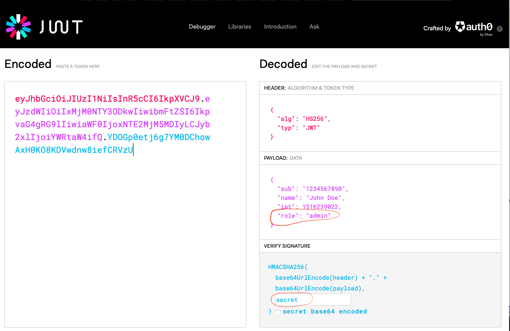

# Using OPA for fine grained authorization inside the mesh

_Note: This lesson is designed to be run by a single persion because this policy will affect the whole mesh. If you are working ahead, please stop here._

In order to run this demo, you will need to have access to an API debugging tool like [Insomnia](http://insomnia.rest) or Postman.

#### Examine policy
```
cat opa.yaml
```

```
CONTEXT=<change-me>
kubectl apply -f opa.yaml --context $CONTEXT
```

After you apply this policy, try calling service. Everybody should get denied.

Open your browser and go to http://jwt.io. Create a JWT with the secret containing value of "secret".


